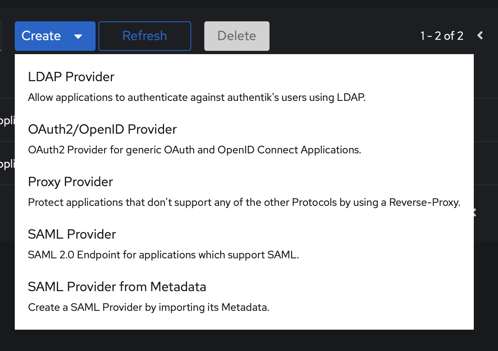
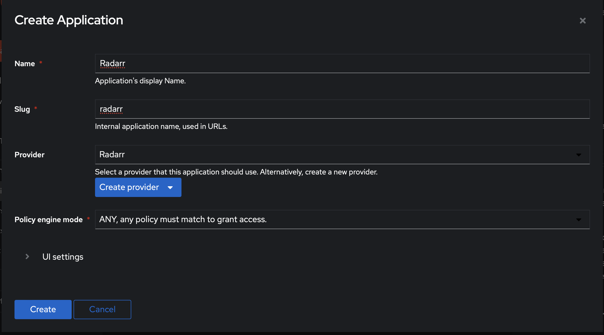
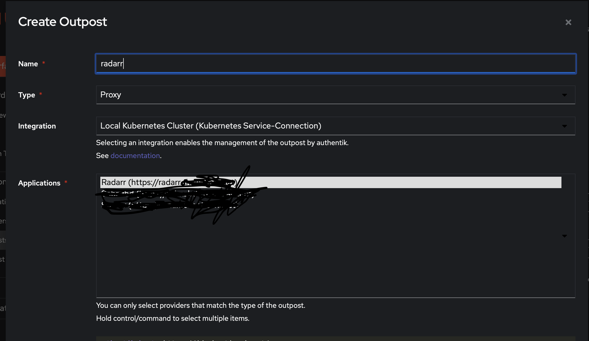

# Authentik Proxy Setup For NGINX Ingress

In order to use authentik proxies there are three steps:

* Create a Provider
* Create an Application
* Create an Outpost
* ?
* Profit

<br>
<br>

## Create a Provider

First Click on Create in the Provider Section, you should see a list of options:



For this case we want to click on Proxy Provider. 
  
You should now see the following window:


The name can be whatever name you want. Make sure it's meaningful to you.  

Next leave the Authorization flow alone to default and make sure Proxy is highlighted.

External host is the URL you want facing outward and protected. you was to put the entire url in (so https://url)

Internal host will be the service name and port so (http://service:7878, or whatever port)

That's it, your done. Below is for radarr:


When you click create you'll see a warning. 

<br>
<br>

## Create an Application

In order to create an application you can follow these steps:

Click the Create Button

This should bring up a window like so:


Create any name you wish to display to the user(s), the slug can be whatever you want as well, just make sure they're unique. 

Now click on Provider and add in the provider we made in the first step.

I keep policy to the default. Now click Create. Below is filled out for radarr from the previous step:



<br>
<br>

## Create an Outpost

Now click on Outposts and click on create to bring up the following window:



Type in the desired meaningful name, select Proxy for your type, then scroll down and change the entire configuration to:

```
log_level: debug
authentik_host: https://<authentik.external.url>/
docker_network: null
container_image: null
docker_map_ports: true
kubernetes_replicas: 1
kubernetes_namespace: <application namespace>
authentik_host_browser: ""
object_naming_template: ak-outpost-%(name)s
authentik_host_insecure: false
kubernetes_service_type: ClusterIP
kubernetes_image_pull_secrets: []
kubernetes_disabled_components:
  - traefik middleware
kubernetes_ingress_annotations:
  external-dns/is-public: "true"
  kubernetes.io/tls-acme: "true"
  kubernetes.io/ingress.class: nginx
  cert-manager.io/cluster-issuer: letsencrypt-prod
kubernetes_ingress_secret_name: <cert_secret>

```

Take note: ```<authentik.external.url>``` is the external url you use to access Authentik, the ```<application namespace>``` is the namespace of the application your protecting, ```cert-manager.io/cluster-issuer:``` should be the ClusterIssuer of cert-manager and populate ```<cert_secret>``` with the name of the secret you want the certificate stored in, so something like outpost-myapp-tls.


In your namespace you should see the new service and ingress spin up, and your done.